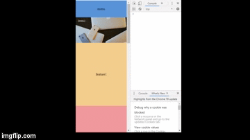

# simpleResponsiveLayout

steps:

clone repo: git clone https://github.com/jolaya182/simpleResponsiveLayout.git

install : npm i

run developer mode: npm start

go to your browser with the localhost url: http://localhost:8080/

or

run the prebuild command: npm run-script prebuild

open the index.html file in the dist folder: simpleResponsiveLayout/dist/index.html